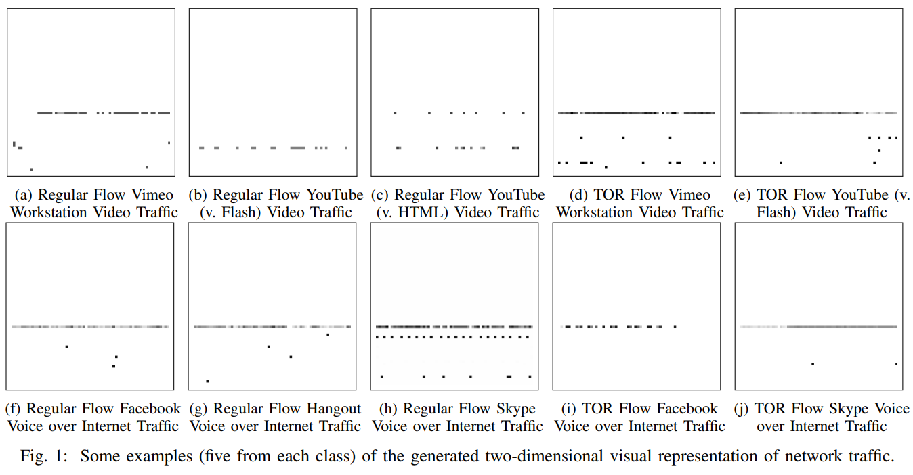
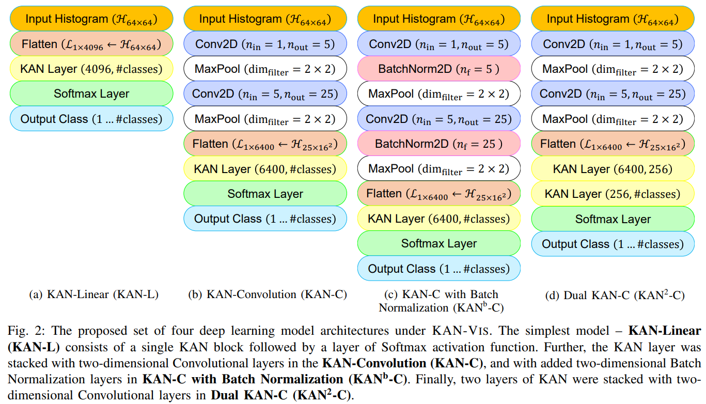

# `KAN-Vis`: Efficient and Lightweight Visual Technique for Network Traffic Classification using Kolmogorov-Arnold Network

_Anurag Dutta_, _Pallavi Anand_, _Sangita Roy_, and _Rajat Subhra Chakraborty_

Network traffic classification is increasingly challenging due to encryption, VPNs, and anonymization like Tor. We propose a visual classifier, `KAN-Vis` using packet-size histogram time-series with the Kolmogorov-Arnold Network (KAN). Our four `KAN-Vis` deep learning models optimize accuracy and computational cost, achieving state-of-the-art results on the `ISCXTor-nonTor` dataset: 93.61% accuracy for Tor traffic (**previous best: 67.8%**) and 96.54% for non-Tor traffic (**previous best: ~85%**). Unlike previous approaches, we also perform intra-class classification, supporting both encrypted and unencrypted traffic while maintaining privacy.

The visual representation-based techniques for network traffic classification are relatively less-explored but effective methods like _FlowPic_ where a visual representation of network traffic characteristics – “histogram” plots of normalized network packet arrival times and packet sizes (bytes) – was constructed, and then input to a convolutional neural network (CNN) for classification. 

Following are the architectural view of the 4 deep learning models proposed under `KAN-Vis`

_A Collaborative work by researchers from the Indian Institute of Technology, Kharagpur, & Thapar Institute of Engineering and Technology_

  
  

