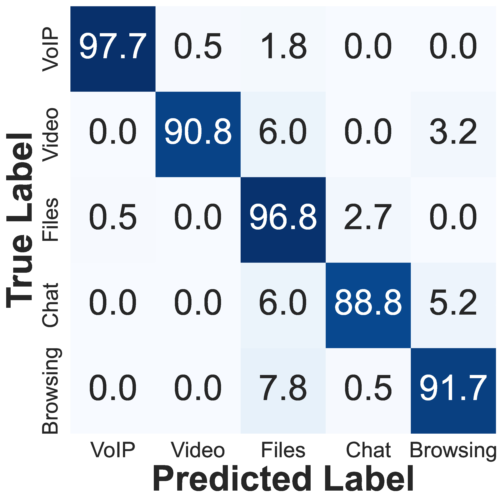
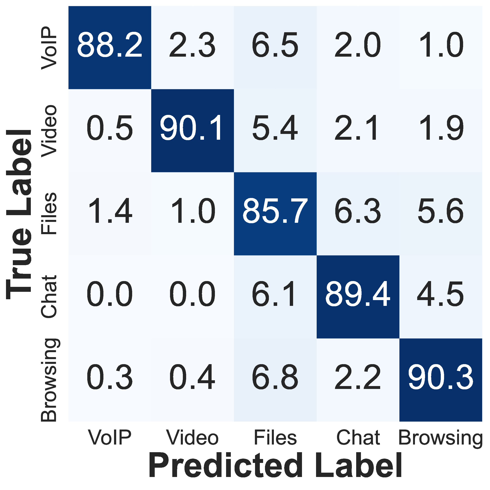
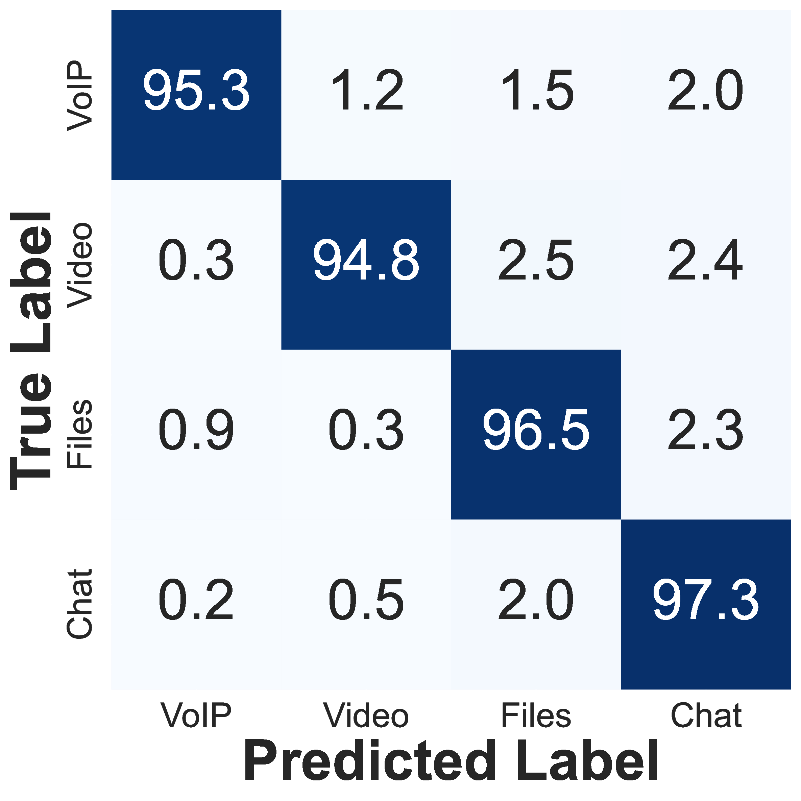
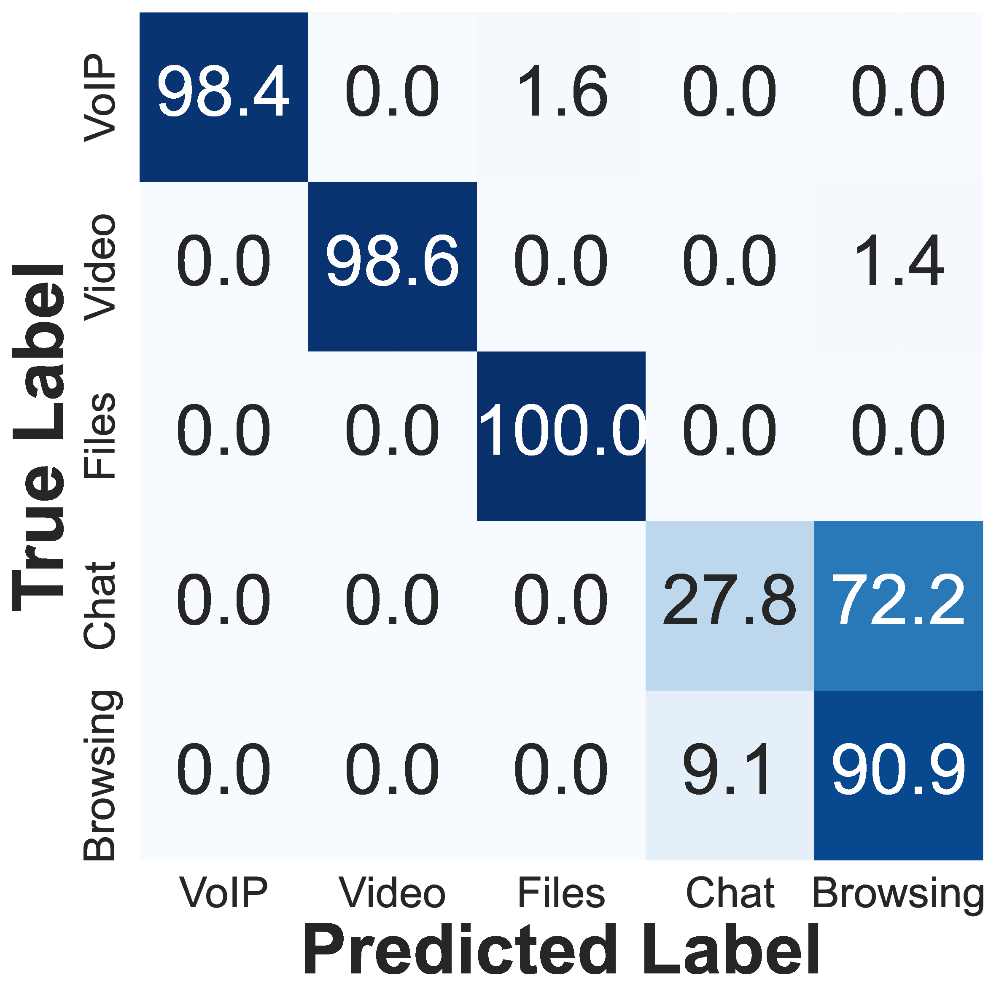
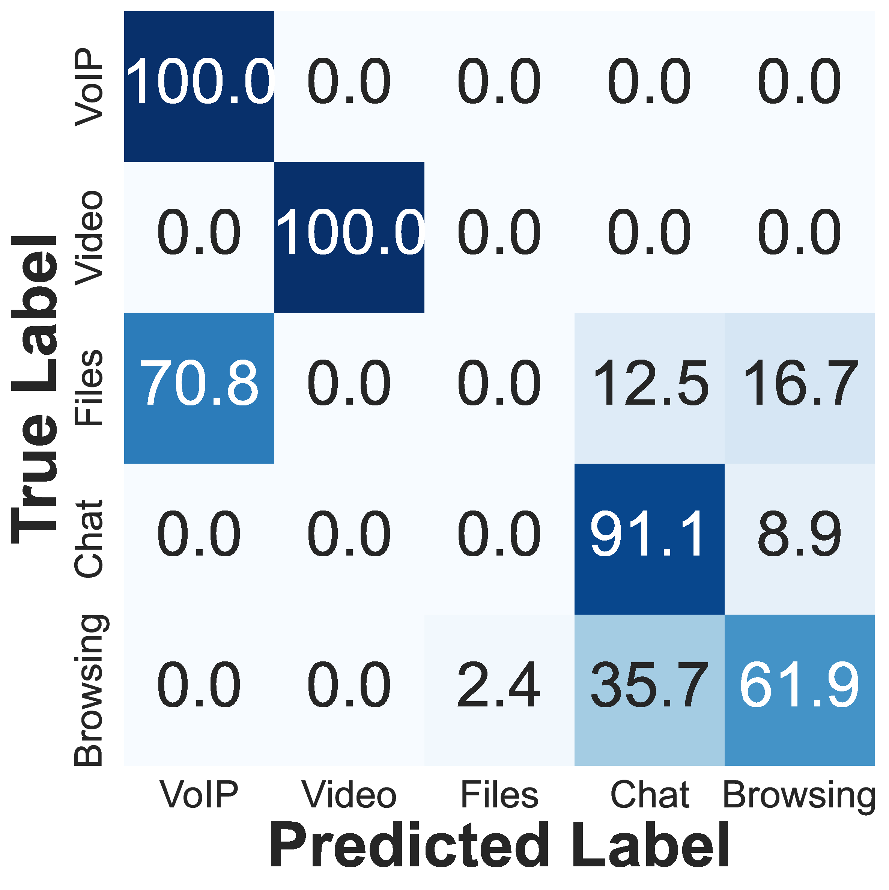
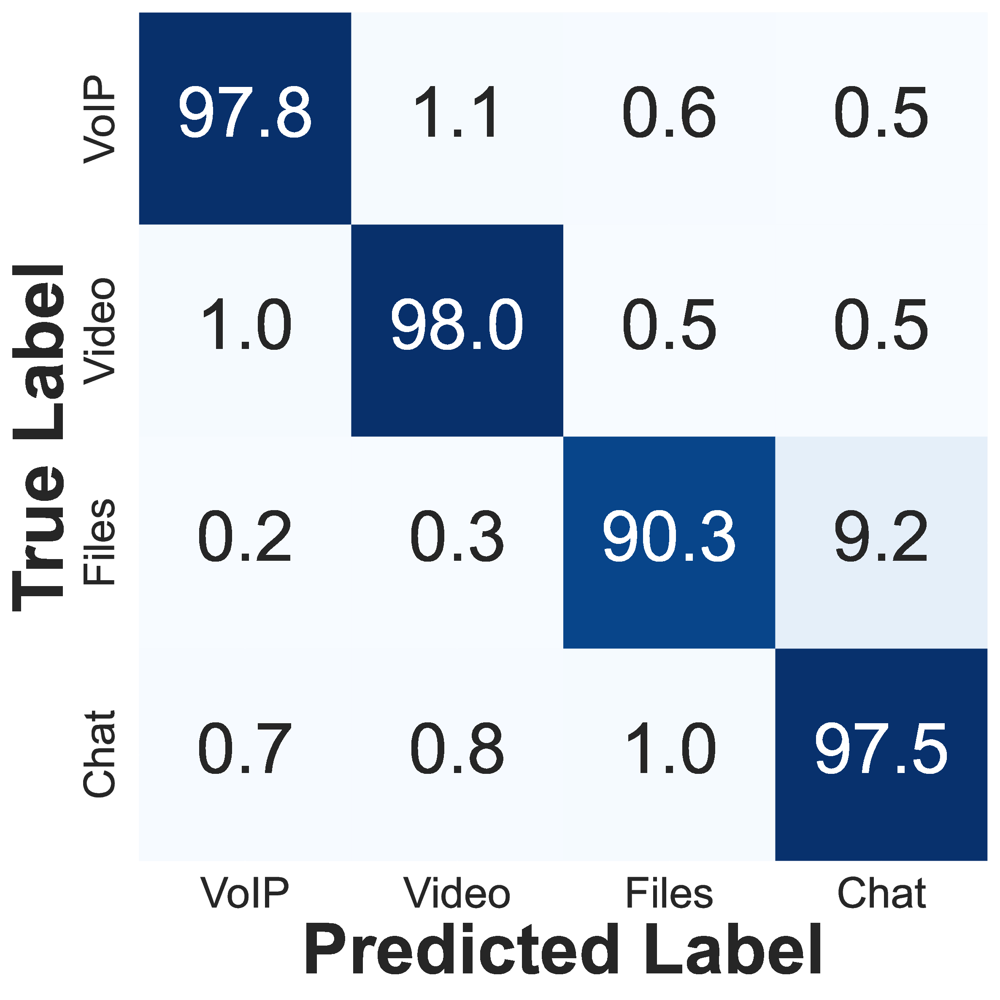

# `KAN-Vis`: Efficient and Lightweight Visual Technique for Network Traffic Classification using Kolmogorov-Arnold Network

Network traffic classification is a problem of fundamental importance in network security and has been widely researched. However, the complexity of this task has increased substantially in recent years due to end-to-end encryption, VPNs, and anonymization schemes like Tor. Existing methods typically extract statistical features from network traffic flows and use machine learning for classification. In this research, we propose a set of four visual network traffic classifiers, collectively called **`KAN-Vis`**, based on the novel Kolmogorov-Arnold Network (KAN) architecture. The input to these models is a pictorial representation of the time series of packet-size histograms. Our models are tested on standard benchmark datasets, including `ISCXTor-nonTor` and `ISCXVPN-nonVPN`, and achieve state-of-the-art results by outperforming previous techniques by **2.03%**, **0.84%**, and **1.98%** for regular, Tor-encrypted, and VPN-protected traffic flows, respectively.

We use a visual representation-based technique similar to *FlowPic*, where normalized histograms of packet arrival times and packet sizes are transformed into images that serve as inputs to deep learning models. `KAN-Vis` achieves high accuracy while being efficient and lightweight.

Following are the architectural view of the 4 deep learning models proposed under `KAN-Vis`

<table style="width: 100%;">
  <tr>
    <td align="center" style="width: 33%;">
       
      <code>Regular KAN-Vis</code>
    </td>
    <td align="center" style="width: 33%;">
       
      <code>Tor KAN-Vis</code>
    </td>
    <td align="center" style="width: 33%;">
       
      <code>VPN KAN-Vis</code>
    </td>
  </tr>
  <tr>
    <td align="center" style="width: 33%;">
       
      <em>Regular FlowPic</em>
    </td>
    <td align="center" style="width: 33%;">
       
      <em>Tor FlowPic</em>
    </td>
    <td align="center" style="width: 33%;">
       
      <em>VPN FlowPic</em>
    </td>
  </tr>
</table>

